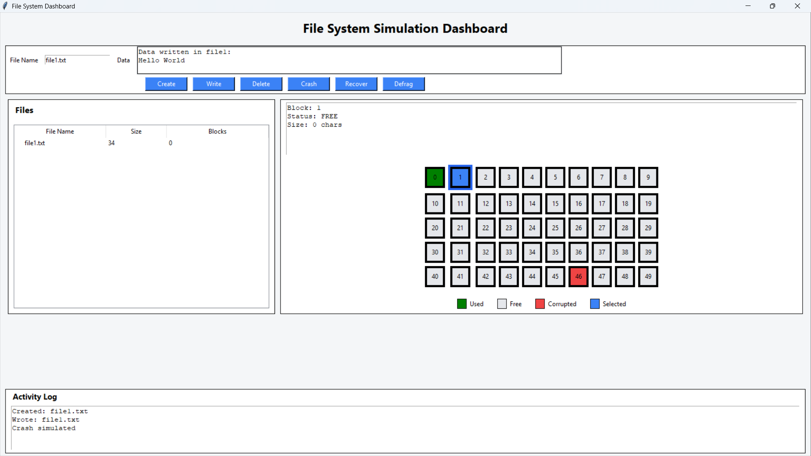

# 🚀 File System Recovery and Optimization Tool


---

## 🖥️ Live Dashboard Preview



## 📌 Overview

The **File System Recovery and Optimization Tool** is a simulation-based Operating Systems project that models how real-world file systems:

- Store data in blocks  
- Manage free space  
- Handle crashes  
- Recover data using journaling  
- Optimize performance via defragmentation  

Unlike traditional CLI-based simulations, this project features a **fully interactive GUI dashboard** that visually demonstrates internal file system operations.

---

## 🎯 Key Highlights

- 🧠 Concept + Implementation (not just theory)
- 💻 Interactive GUI visualization (Tkinter-based dashboard)
- 💥 Crash simulation with recovery
- ⚡ Performance optimization (defragmentation)
- 📊 Real-time disk state monitoring

---

## 🧠 System Architecture

```text
        User Interface (GUI)
                ↓
        File System Layer
   ┌────────────┼────────────┐
   │            │            │
File Manager  Recovery    Optimization
               Manager        Manager
                ↓
        Virtual Disk (Blocks + Bitmap)
⚙️ Workflow
User Action (Create / Write / Delete)
            ↓
File System Processing
            ↓
Block Allocation (Bitmap)
            ↓
Disk Update (Virtual Storage)
            ↓
-----------------------------------
Optional Operations:
💥 Crash Simulation
🔄 Recovery (Journaling Replay)
⚡ Defragmentation
✨ Features
📦 Core File System
Block-based virtual disk simulation
Bitmap-based free space management
File allocation (contiguous allocation)
Persistent storage (JSON-based)
📁 File Operations
Create file
Write data (multi-block support)
Read data
Delete file
💥 Crash & Recovery
Simulated disk corruption
Write-Ahead Logging (WAL)
Recovery via log replay
Corrupted block cleanup
⚡ Optimization Engine
Fragmentation detection
Defragmentation algorithm
Read performance measurement
🖥️ Interactive GUI
File explorer-style interface
Disk block visualization (color-coded)
Clickable blocks with detailed inspection
Animated write operations
Block selection highlighting (glow effect)
Real-time activity log
Live system statistics
🎨 Disk Visualization Legend
Color	Meaning
🟢 Green	Used Block
⚪ Grey	Free Block
🔴 Red	Corrupted Block
🔵 Blue	Selected Block
🗂️ Project Structure
FileSystemTool/
│
├── main.py                # Entry point (CLI testing)
├── gui.py                 # Interactive GUI dashboard
│
├── disk.py                # Virtual disk implementation
├── file_system.py         # File system logic
├── allocation.py          # Block allocation logic
├── recovery.py            # Crash + recovery system
├── optimization.py        # Defragmentation + performance
├── utils.py               # Helper utilities
│
├── data/
│   ├── disk_state.json
│   └── file_table.json
│
├── logs/
│   └── journal.log
│
└── README.md
📸 Demo Screenshots
🖥️ GUI Dashboard

📊 Disk Visualization

📁 File System View

📌 (Add your screenshots in /assets folder)

🖥️ Example Execution (CLI)
> create file1
✔ File created

> write file1 HelloWorld
✔ Data written

> show_disk
Block 0: USED | Data: HelloWorld
Block 1: FREE
...
🛠️ Tech Stack
Category	Technology
Language	Python 3.10+
GUI	Tkinter
Storage	JSON
Concepts	OS File Systems
Tools	VS Code, Git, GitHub
🚀 Getting Started
🔹 Clone Repository
git clone https://github.com/your-username/FileSystemTool.git
cd FileSystemTool
🔹 Run GUI
python gui.py
🔹 Run CLI (optional)
python main.py
📊 Concepts Demonstrated
File Allocation Strategies (Contiguous)
Free Space Management (Bitmap)
Disk Scheduling Simulation
Journaling & Crash Recovery
Fragmentation & Defragmentation
File System Abstraction
🧪 Future Enhancements
📂 Hierarchical directory structure
🧠 LRU caching mechanism
📊 Graph-based performance analytics
🌐 Web-based UI (React / Flask)
🔐 File permissions & security
🎓 Learning Outcomes

This project provides hands-on understanding of:

Internal working of file systems
Impact of fragmentation on performance
Recovery mechanisms in OS
Trade-offs in allocation techniques
🤝 Contributing
Fork → Create Branch → Commit → Push → Pull Request
📜 License

This project is licensed under the MIT License.

⭐ Support

If you found this project useful, consider giving it a ⭐!

👨‍💻 Authors

Developed as part of an Operating Systems project to simulate real-world file system behavior with recovery and optimization capabilities.

🔥 Final Note

This is not just a project—
it is a working simulation of how real file systems behave internally, combining theory, implementation, and visualization in one system.
